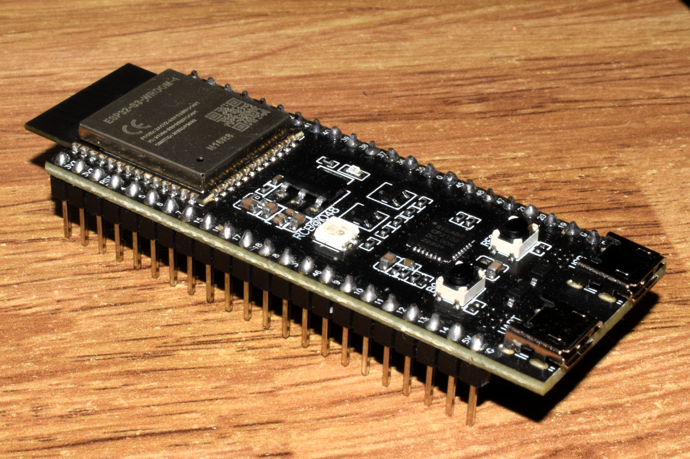

# Rainforest Audio Classifier

> Empowering Conservation Through AI on the Edge 🌿

This project focuses on classifying audio signals into two categories: **environmental sounds** and **chainsaw activity**, by using a scaled-down machine learning model, aiding in monitoring and combating illegal deforestation activities in rainforest areas.

The trained model is designed for deployment on an **ESP32** microcontroller for edge computing applications.



## Dataset Specification

The dataset comprises a large collection of short audio clips capturing sounds of chainsaws at varying distances, alongside natural environmental sounds. These recordings were gathered using **Guardian devices** deployed by the [Rainforest Connection (RFCx)](https://rfcx.org/), a non-profit organization leveraging eco-acoustics and AI to protect endangered ecosystems.

### Key Characteristics

- **Regions Covered:** Most recordings originate from _South America_ and _Southeast Asia_.
- **Objective:** This dataset is specifically curated to train AI models for detecting chainsaw activity, supporting efforts to combat illegal logging in rainforests.
- **Audio format:** `.wav` files.
- **Class Labels:**
  ```json
  { "0": "chainsaw", "1": "environment" }
  ```
- **Dataset Split:** The dataset has been divided into a 70:30 train-test ratio by the organization.
  - Train dataset: `35275` non-corrupt audio files.
  - Test dataset: `15117` non-corrupt audio files.

### Dataset Source

The data is publicly available on the [Hugging Face Datasets Repository](https://huggingface.co/datasets/rfcx/frugalai) as part of the [FrugalAI Challenge](https://frugalaichallenge.org/).

### Sample Audio Files (converted to mp3 for multi-platform audioplay support)

#### Environment:

<audio controls="controls">
  <source type="audio/mp3" src="assets/env.mp3"></source>
  <p>Your browser does not support the audio element. <a href="assets/env.mp3" target="_blank">View in new tab.</a></p>
</audio>

#### Chainsaw:

<audio controls="controls">
  <source type="audio/mp3" src="assets/chainsaw.mp3"></source>
  <p>Your browser does not support the audio element. <a href="assets/chainsaw.mp3" target="_blank">View in new tab.</a></p>
</audio>

## Setup and Model Training Instructions

### 1. Setting Up the Environment

First, ensure you have Python 3.10+ installed. Then, create a virtual environment and activate it:

```bash
cd training
python3 -m venv venv
source venv/bin/activate  # On Windows use `venv\Scripts\activate`
```

### 2. Installing Dependencies

Install the required Python packages using `pip`:

```bash
pip install -r requirements.txt
```

### 3. Preparing the Dataset

Download and clean up the dataset from the [Hugging Face Datasets Repository](https://huggingface.co/datasets/rfcx/frugalai) by running the `data_prep.py` script:

```bash
python data_prep.py
```

### 4. Training the Model

Run the training script to train the model on the dataset:

```bash
python train.py
```

This will save the trained model in the `checkpoints` directory.

### 5. Convert PyTorch model to TFLite

Convert the trained PyTorch model to TFLite format using the provided script:

```bash
python pytorch_to_tflite.py
```

This script will:

1. Load the PyTorch model from checkpoints
2. Convert it to ONNX format
3. Transform it to TensorFlow
4. Export the final TFLite model to `M5_model.tflite`

### 6. Converting the Model for ESP32

Convert the trained model to a C array format suitable for the ESP32 firmware. You can use the `xxd` tool for this:

```bash
xxd -i M5_model.tflite > model.cc
```

### 7. Integrating the Model with Firmware

Replace the existing model array in the firmware with the newly generated model array. Open the `firmware/src/model.cc` file and replace its contents with the contents of `model_output/model.cc`.

### 8. Flashing the Firmware

Finally, compile and flash the firmware to your ESP32 device using platformio.
Ensure your ESP32 is connected to your computer and in flashing mode.

### 9. Testing the Deployment

After flashing, reset your ESP32 and monitor the serial output to verify that the model is running correctly and classifying audio inputs as expected.
